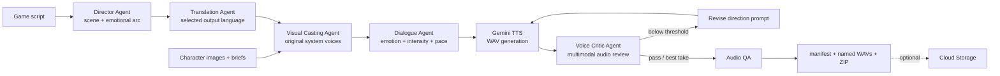

# RoleVox

RoleVox turns a multilingual game script and per-character visual references into directed, cast, quality-checked
voice assets. It targets independent game teams that need more than raw TTS: the
system makes production decisions, listens to its own output, revises weak takes,
and packages approved files for a game repository.

The current workflow is project-first. Creators establish the world and scene, add
Character Cards, and let Visual Casting combine each image, brief, and project context
into a reusable Voice Identity. Production is unavailable until every identity is
explicitly locked. All later dialogue for that project reuses the same prebuilt voice,
pitch, texture, speaking style, and accent profile.

Transient TTS audio-completion failures use a bounded recovery sequence: retry the
same system voice, retry with a simpler performance prompt, then switch to a
different allowed system voice if necessary. The selected fallback is recorded in
the manifest, while the requested dialogue text is never rewritten.

For a Voice-Locked character, recovery never switches to a different voice. Voice
Critic stores every take, scores emotion match, character consistency, pronunciation,
and scene fit, then records the exact Auto Revision applied before regenerating. Draft,
Production, and Cinematic targets replace an ambiguous numeric quality slider.

Users first select Traditional Chinese, English, or Japanese as the voice-output
language. Translation Agent localizes every source line before performance analysis
and TTS, while the manifest retains both source and translated text. RoleVox uses only
Google's prebuilt synthetic voices. It does not accept voice samples or imitate
real people.

## Agent workflow



The web request returns immediately with a Firestore-backed job ID. Cloud Tasks then
invokes an OIDC-protected synchronous Cloud Run worker, while the browser polls the
structured event trace. The production Director stage runs through a real Google ADK
`InMemoryRunner`; the resulting ADK trace is stored in the manifest and Autonomous Run Receipt.

## Tech stack

- Gemini 3.5 Flash: visual-reference casting, direction, line analysis, and multimodal voice critique
- Gemini 3.1 Flash TTS Preview: controllable multilingual speech
- Google Agent Development Kit: production Director runtime and inspectable workflow
- FastAPI + vanilla web UI: asynchronous production dashboard
- Google Cloud Run + Cloud Tasks: hosted application and durable, throttled production workers
- Firestore: project, Voice Lock, job, event trace, result, and inbox-idempotency state
- Eventarc + private Cloud Storage: autonomous inbox trigger and generated asset delivery

## Run locally

Requirements: Python 3.11+, a Google Cloud project with billing, and the Google Cloud CLI.

```powershell
python -m venv .venv
.\.venv\Scripts\Activate.ps1
python -m pip install -r requirements-dev.txt -c constraints.txt
Copy-Item .env.example .env
```

Authenticate locally with Application Default Credentials:

```powershell
gcloud auth login
gcloud auth application-default login
gcloud config set project YOUR_PROJECT_ID
gcloud services enable aiplatform.googleapis.com
```

Edit `.env`, set `GOOGLE_CLOUD_PROJECT` to the same project ID, and keep
`GOOGLE_CLOUD_LOCATION=global`. Then run:

```powershell
uvicorn main:app --reload
```

Open `http://127.0.0.1:8000`. Keep a first run to three or four short lines: each
line uses one TTS request and one multimodal critique request, plus retries.

To inspect the declared workflow with ADK's development UI:

```powershell
adk web
```

Select `rolevox_agent` in the ADK interface.

### No-key walkthrough

For UI development only, set `DEMO_MODE=true`. This creates audible synthetic
tones, runs the complete job/package path, and labels the UI as Demo Mode. These
tones are not AI-generated character speech and must not be presented as such in
the submission demo.

## Script format

Use one line per utterance. Both ASCII and full-width colons are accepted.

```text
璃央：等等……門後面有東西在呼吸。
Mara: Then we stop running and face it together.
レン：大丈夫。僕が先に行く。
```

Translation Agent preserves character names and IDs while localizing the spoken text;
Dialogue Agent then adds performance notes without rewriting the translation. The
MVP accepts up to 24 dialogue lines per job to contain
runtime and API cost.

## Character references

RoleVox extracts unique character names from the script. Each character card accepts
one PNG, JPEG, or WebP image up to 5 MB and a creator brief up to 1,000 characters.
Gemini evaluates fictional design cues such as archetype, expression, posture, costume,
visual energy, and scene mood, then selects a prebuilt voice and emotion baseline.
Images are not placed in the downloadable ZIP. Local projects use
`artifacts/projects/<project-id>`; the deployed service stores project records and locked
identities in Firestore and references in private Cloud Storage, so a cold start does not
silently recast a character.

## Project workflow

1. Create a project with a name, scene, and world background.
2. Add each original character image and creator brief.
3. Review the visible Visual Casting Result and lock the Voice Identity.
4. Open Character Cards to add emotion-directed dialogue lines.
5. Select Chinese, Japanese, or English and a Draft, Production, or Cinematic target.
6. Set the Agent Revision Limit and run production.
7. Review Take 01, Critic feedback, Auto Revision, and the approved later take.

## Test

```powershell
python -m pytest -q
```

Tests force Demo Mode and cover three-language production, per-character multipart
image upload, unsafe file rejection, and ZIP delivery.

## Deploy to Google Cloud Run

```powershell
gcloud auth login
gcloud config set project YOUR_PROJECT_ID
gcloud services enable run.googleapis.com cloudbuild.googleapis.com aiplatform.googleapis.com
gcloud run deploy rolevox --source . --region asia-east1 --allow-unauthenticated `
  --set-env-vars GOOGLE_GENAI_USE_VERTEXAI=true,GOOGLE_CLOUD_PROJECT=YOUR_PROJECT_ID,GOOGLE_CLOUD_LOCATION=global
```

The deployed version uses Application Default Credentials and a dedicated runtime
service account; no AI Studio API key is stored. Firestore persists jobs and projects,
Cloud Tasks dispatches production, Eventarc watches the private `inbox/` prefix, and GCS
stores WAVs, `manifest.json`, `run_receipt.json`, and the ZIP under `rolevox/<job-id>/`.
See [docs/ARCHITECTURE.md](docs/ARCHITECTURE.md) for exact resources, identity boundaries,
idempotency, and Free Trial cost guardrails.

## API

- `GET /api/health` — runtime mode, model IDs, and configuration state
- `GET /api/voices` — the 30 allowed system voices
- `POST /api/projects` — create a persistent RoleVox project
- `GET /api/projects` — list saved projects for the Project Library
- `POST /api/projects/{id}/characters` — multimodal Visual Casting for a Character Card
- `POST /api/projects/{id}/characters/{character-id}/lock` — lock its Voice Identity
- `POST /api/projects/{id}/characters/{character-id}/unlock` — unlock it before recasting or review
- `POST /api/projects/{id}/characters/{character-id}/dialogues` — add an emotion-directed line
- `POST /api/projects/{id}/produce` — produce one selected character or the full cast
- `POST /api/jobs` — validate and enqueue a production
- `POST /api/jobs/with-references` — enqueue multipart production with mapped character images
- `POST /api/inbox/events` — OIDC-protected Eventarc storage target
- `POST /api/jobs/{id}/execute` — OIDC-protected Cloud Tasks worker target
- `GET /api/jobs/{id}` — progress, agent event trace, and result
- `GET /api/jobs/{id}/files/{name}` — generated WAV
- `GET /api/jobs/{id}/package` — game asset ZIP

## Responsible voice policy

- No voice uploads or voice cloning endpoints
- Casting Agent is constrained to an explicit allowlist of prebuilt voices
- Prompts prohibit real-person imitation and describe characters fictionally
- Visual analysis is limited to fictional performance cues and prohibits identity or sensitive-trait inference
- Generated manifests and Autonomous Run Receipts record the voice, model, QA score,
  retry count, event trace, selected take, and SHA-256 hash
- Projects should disclose AI-generated audio to players and follow platform rules
