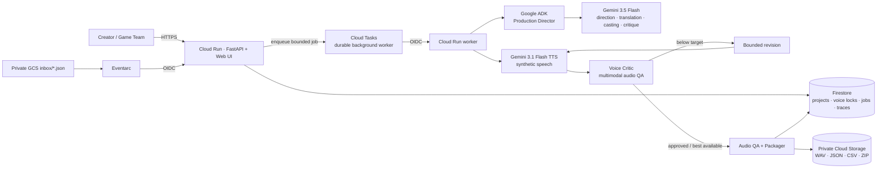
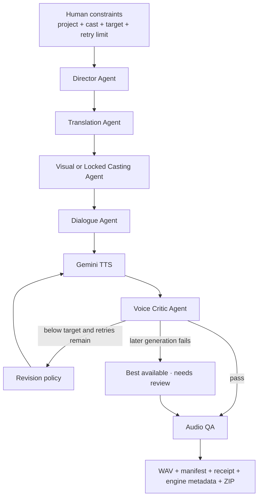

# RoleVox

**An autonomous, voice-locked game dialogue production studio built with Gemini 3.5, Google ADK, and Google Cloud.**

[Live demo](https://rolevox-919890071642.asia-east1.run.app) · [Detailed cloud architecture](docs/ARCHITECTURE.md)

RoleVox turns character art, creative briefs, world context, and multilingual scripts into directed, translated, quality-reviewed, game-ready voice assets. It is built for independent game teams that need more than raw text-to-speech: RoleVox makes production decisions, listens to its own output, revises weak takes, preserves character identity across scenes, and packages the result for implementation.

RoleVox targets the **Taskmaster** category of the [All Things Agentic Hackathon](https://allthingsagentichackathon.devpost.com/).

## The problem

Game dialogue production is a fragmented workflow. A small team must interpret character art, cast voices, maintain consistency, translate scripts, direct every line, review takes, request revisions, name files, and prepare engine metadata. Traditional TTS handles only one part of that work.

RoleVox converts those disconnected steps into one bounded and inspectable background production run.

## Why this is an agent, not a TTS wrapper

The creator supplies the world, cast, script, quality target, and safety limits. Specialized agents then:

1. interpret the scene and emotional arc;
2. translate the script into the selected performance language;
3. reuse the approved Voice Identity for every appearance of a character;
4. plan line-level emotion, intensity, pace, and addressee-aware delivery;
5. generate WAV takes;
6. listen to and score the generated audio;
7. revise weak performances within a human-selected limit;
8. recover from transient TTS failures;
9. select, hash, document, and package final assets.

The browser can be closed while Cloud Tasks continues the job. Project Run History reconnects to the persisted Firestore state without creating a duplicate production.

## Core capabilities

| Capability | Result |
|---|---|
| Project Workspace | Persists the world, scene, cast, dialogue, and production history. |
| Visual Casting | Combines character art, a creator brief, and scene context into a reusable Voice Identity. |
| Explainable Confidence | Separates image evidence, brief alignment, and scene alignment. |
| Voice Lock | Requires human approval of an allowlisted synthetic voice before production. |
| Context-aware preview | Auditions a line generated from the character and project background. |
| Three workflows | Supports one-off lines, multi-character dialogue, and Character Voice Packs. |
| Voice-event drafting | Creates editable variants for social, exploration, combat, damage, quest, and relationship events. |
| Script import | Accepts CSV, JSON, XLSX, Ink, Yarn, and TXT. |
| Multilingual output | Produces Traditional Chinese, English, or Japanese while retaining source text. |
| Voice Critic | Scores emotion match, character consistency, pronunciation, and scene fit. |
| Bounded revision | Turns Critic feedback into explicit direction and regenerates within the selected limit. |
| Best-available recovery | Preserves a successful take if a later revision fails. |
| Retry and merge | Repairs one line and rebuilds the original package, hashes, and manifests. |
| Production Preflight | Shows line, take, and TTS-call bounds before generating audio. |
| Durable Run History | Reopens jobs, resumes live status, names runs, downloads packages, and deletes finished cloud assets on request. |
| Consistency Dashboard | Summarizes Critic-derived Voice Identity consistency across a run. |
| Game-ready ZIP | Includes WAV, manifest, autonomous receipt, and Generic, Unity, Godot, and Unreal metadata. |

## Architecture



The studio returns a job ID immediately. Cloud Tasks invokes an OIDC-protected worker and keeps the request alive until production finishes. The UI polls the Firestore-backed job and renders a human-readable agent event trace.

See [docs/ARCHITECTURE.md](docs/ARCHITECTURE.md) for IAM identities, idempotency, persistent state, and cost controls.

## Agent control loop



### Human decisions

- project, scene, world background, and character brief;
- final Voice Lock;
- dialogue or voice-event selection;
- output language and production target;
- maximum automatic revision count;
- final review, line retry, download, and deletion.

### Autonomous decisions

- scene direction and emotional arc;
- translation and contextual addressee inference;
- casting recommendations from the synthetic voice allowlist;
- emotion, intensity, pace, and performance prompts;
- Critic scores and revision parameters;
- best-take selection, recovery, hashing, and packaging.

This separation keeps creative identity under human control while delegating repetitive operational work.

## Google technology stack

| Google technology | Role in RoleVox |
|---|---|
| Gemini 3.5 Flash on Vertex AI | Direction, translation, Visual Casting, draft generation, dialogue planning, and multimodal Voice Critic. |
| Gemini 3.1 Flash TTS Preview | Controllable game dialogue synthesis. |
| Google Agent Development Kit | Inspectable Production Director runtime. |
| Google Gen AI SDK | Gemini and TTS integration. |
| Cloud Run | Web application and synchronous production worker. |
| Cloud Tasks | Durable, throttled background dispatch with OIDC authentication. |
| Firestore | Projects, Character Cards, Voice Locks, jobs, progress, traces, and idempotency claims. |
| Cloud Storage | Private character references and generated audio packages. |
| Eventarc | Private Cloud Storage inbox trigger. |

Gemini 3.5 satisfies the reasoning-model requirement; Gemini 3.1 Flash TTS is used specifically for speech synthesis.

## Production reliability

- **Durable execution:** Cloud Tasks owns the long-running worker request.
- **Idempotent inbox:** a SHA-256 key based on `bucket/object#generation` blocks duplicate Eventarc productions.
- **Voice-Lock enforcement:** a locked character never silently switches voice.
- **TTS recovery:** transient failures retry with bounded, simpler directions.
- **Best-available packaging:** a successful earlier take survives a later generation failure.
- **Single-line repair:** a retry is merged into the original package and all hashes are rebuilt.
- **Bounded autonomy:** maximum 24 production lines and 3 revisions per line.
- **Preflight:** maximum take and TTS-call ranges are shown before production.
- **Inspectable output:** each WAV records the selected take, Critic result, and SHA-256 hash.

## Responsible voice policy

RoleVox deliberately uses only Google's prebuilt synthetic voices.

- No voice-upload or voice-cloning endpoint.
- No real-person imitation.
- Casting is constrained to an explicit voice allowlist.
- Visual analysis is limited to fictional performance cues and excludes identity or sensitive-trait inference.
- Character images are not included in downloadable packages.
- Voice Identity changes require an explicit unlock and recast.
- Users should disclose AI-generated audio and follow applicable platform rules.

## Output package

```text
project_scene_voice_assets.zip
├── aria_greeting_01.wav
├── aria_greeting_02.wav
├── aria_combat_start_01.wav
├── manifest.json
├── run_receipt.json
├── generic_dialogue_manifest.csv
├── unity_rolevox_manifest.json
├── godot_rolevox_manifest.json
└── unreal_rolevox_datatable.json
```

`manifest.json` contains source and translated dialogue, casting, performance direction, QA, and asset names.

`run_receipt.json` contains the run ID, origin, timestamps, orchestrator, human constraints, agent trace, model IDs, voice policy, selected takes, retries, and final SHA-256 hashes.

## Quick judge walkthrough

Open the [hosted RoleVox studio](https://rolevox-919890071642.asia-east1.run.app), then:

1. Open an existing project or create a world.
2. Add an original fictional character image and brief.
3. Review Visual Casting, choose a voice, and lock it.
4. Add dialogue, import a script, or choose **Character Voice Pack**.
5. Select the language, target, and revision limit.
6. Review Production Preflight and start the background run.
7. Watch the live agent trace or reopen it through **Project Run History**.
8. Review the Consistency Dashboard, Critic feedback, and automatic revisions.
9. Retry a weak line if needed.
10. Download and inspect the WAV, manifest, receipt, and engine metadata.

Gemini TTS is a preview service and can occasionally be busy. RoleVox exposes retry state and preserves the best successful take when a later revision fails.

## Run locally

### Prerequisites

- Python 3.11+
- Google Cloud CLI
- A Google Cloud project with billing or Free Trial credits
- Vertex AI API enabled

### Windows PowerShell

```powershell
git clone https://github.com/yian3690/RoleVox.git
cd RoleVox
python -m venv .venv
.\.venv\Scripts\Activate.ps1
python -m pip install -r requirements-dev.txt -c constraints.txt
Copy-Item .env.example .env
gcloud auth login
gcloud auth application-default login
gcloud config set project YOUR_PROJECT_ID
gcloud services enable aiplatform.googleapis.com
```

Edit `.env`:

```dotenv
GOOGLE_GENAI_USE_VERTEXAI=true
GOOGLE_CLOUD_PROJECT=YOUR_PROJECT_ID
GOOGLE_CLOUD_LOCATION=global
GEMINI_TEXT_MODEL=gemini-3.5-flash
GEMINI_TTS_MODEL=gemini-3.1-flash-tts-preview
DEMO_MODE=false
```

Run:

```powershell
uvicorn main:app --reload
```

Open **http://127.0.0.1:8000**.

### macOS or Linux

```bash
git clone https://github.com/yian3690/RoleVox.git
cd RoleVox
python3 -m venv .venv
source .venv/bin/activate
python -m pip install -r requirements-dev.txt -c constraints.txt
cp .env.example .env
gcloud auth login
gcloud auth application-default login
gcloud config set project YOUR_PROJECT_ID
gcloud services enable aiplatform.googleapis.com
uvicorn main:app --reload
```

### No-cost UI walkthrough

Set `DEMO_MODE=true` for local interface and package testing without model calls. Demo Mode creates audible test tones and exercises the workflow, retry, metadata, and ZIP path. It is not AI-generated speech and must not be presented as such.

### Inspect the ADK agent

```powershell
adk web
```

Select `rolevox_agent` in the ADK interface.

## Deploy to Cloud Run

Enable the baseline services:

```powershell
gcloud auth login
gcloud config set project YOUR_PROJECT_ID
gcloud services enable run.googleapis.com cloudbuild.googleapis.com aiplatform.googleapis.com firestore.googleapis.com cloudtasks.googleapis.com storage.googleapis.com eventarc.googleapis.com
```

Deploy:

```powershell
gcloud run deploy rolevox --source . --region asia-east1 --allow-unauthenticated --max-instances 1 --concurrency 2 --set-env-vars GOOGLE_GENAI_USE_VERTEXAI=true,GOOGLE_CLOUD_PROJECT=YOUR_PROJECT_ID,GOOGLE_CLOUD_LOCATION=global
```

This baseline works for evaluation. The submitted deployment additionally uses a dedicated runtime identity, Firestore, a private GCS bucket, a single-dispatch Cloud Tasks queue, OIDC-only worker invocation, Eventarc, minimum instances 0, maximum instances 1, and concurrency 2. Exact environment variables and identity boundaries are in [docs/ARCHITECTURE.md](docs/ARCHITECTURE.md) and [`.env.example`](.env.example).

## Script import

Character Cards must exist before import, and speaker names must match them.

```csv
Character,Text,Emotion,Addressee
Aria,Someone is beyond the gate,Alert · restrained · urgent,Odric
Odric,Hold the line,Grave · calm · commanding,Aria
```

TXT, Ink, and Yarn can use:

```text
Aria: Someone is beyond the gate.
Odric: Hold the line.
```

Imported lines remain editable. One file can contain up to 500 rows; one production run remains limited to 24 lines.

## Tests

```powershell
python -m pytest -q
node --check static/app.js
```

The current suite contains **26 passing tests** covering multilingual production, persistence, Voice Lock, recasting, script import, Voice Packs, unsafe uploads, recovery, history naming and deletion, consistency metrics, engine exports, line merging, packaging, OIDC-protected workers, and Eventarc.

## API overview

### Projects and characters

- `GET/POST /api/projects`
- `GET/PATCH/DELETE /api/projects/{project_id}`
- `POST /api/projects/{project_id}/characters`
- `PATCH/DELETE /api/projects/{project_id}/characters/{character_id}`
- `POST /api/projects/{project_id}/characters/{character_id}/lock`
- `POST /api/projects/{project_id}/characters/{character_id}/unlock`
- `POST /api/projects/{project_id}/characters/{character_id}/recast`

### Dialogue and production

- `POST /api/projects/{project_id}/characters/{character_id}/dialogues`
- `POST /api/projects/{project_id}/dialogues/import`
- `GET /api/voice-events`
- `POST /api/projects/{project_id}/voice-pack/draft`
- `POST /api/projects/{project_id}/produce`
- `GET /api/projects/{project_id}/jobs`
- `PATCH/DELETE /api/projects/{project_id}/jobs/{job_id}/history`
- `GET /api/jobs/{job_id}`
- `POST /api/jobs/{job_id}/lines/{line_id}/merge-retry`
- `GET /api/jobs/{job_id}/files/{filename}`
- `GET /api/jobs/{job_id}/exports/{filename}`
- `GET /api/jobs/{job_id}/package`

### Protected automation

- `POST /api/jobs/{job_id}/execute` — OIDC-protected Cloud Tasks worker
- `POST /api/inbox/events` — OIDC-protected Eventarc receiver

## Repository structure

```text
RoleVox/
├── app/
│   ├── adk_agent.py
│   ├── models.py
│   ├── pipeline.py
│   ├── state_store.py
│   └── task_queue.py
├── rolevox_agent/
├── static/
├── tests/
├── docs/ARCHITECTURE.md
├── main.py
├── Dockerfile
└── requirements.txt
```

## Current limitations

- Gemini TTS is a preview model and may return transient capacity errors.
- RoleVox uses prebuilt synthetic voices only.
- The public demo is a shared judging workspace; do not upload confidential material.
- Production is limited to 24 lines per run.
- Casting Confidence and Voice Consistency are explainable model-derived QA scores, not biometric or statistical certainty.

## Content responsibility

RoleVox includes no third-party character, franchise, celebrity, or real-person assets. Users are responsible for permission to use uploaded images, scripts, and generated audio.
