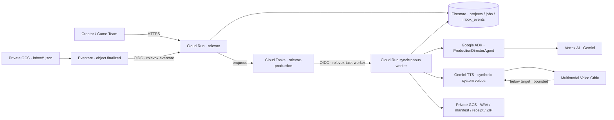

# RoleVox Cloud Architecture

RoleVox is a durable, event-driven game-character voice production system. The deployed service uses Google Cloud project `project-2394c6ba-f2ab-4f5a-90e` in `asia-east1`; Gemini and Gemini TTS requests use Vertex AI's `global` endpoint.

## Agentic control loop

1. Google ADK's `ProductionDirectorAgent` turns the project, scene, and dialogue into dramatic direction.
2. Translation Agent localizes every line into Chinese, Japanese, or English while retaining source text.
3. Casting Agent either reuses a locked Voice Identity or performs multimodal visual casting from the character image and brief.
4. Dialogue Agent plans emotion, intensity, pace, and addressee-aware delivery.
5. Gemini TTS generates a take using an allowlisted prebuilt synthetic voice.
6. Voice Critic listens to the WAV and scores emotion match, character consistency, pronunciation, and scene fit.
7. A weak take produces explicit revision parameters and is regenerated within the creator's revision limit.
8. Audio QA selects the best take, hashes it, and packages it with `manifest.json` and `run_receipt.json`.

## Durability and idempotency

- Firestore stores Project Records, Voice Locks, job progress, event traces, results, and immutable inbox-event claims.
- A SHA-256 key derived from `bucket/object#generation` prevents duplicate Eventarc delivery from producing duplicate jobs.
- Cloud Tasks keeps the worker HTTP request active until production completes, so Cloud Run request-based CPU is never expected to continue after a response.
- Task names are deterministic (`job-<job-id>`), queue concurrency is one, and completed worker calls are idempotent.
- Character references and completed assets are read back from private GCS after Cloud Run cold starts.

## Identity boundaries

| Identity | Scope |
|---|---|
| `rolevox-runtime` | Vertex AI user, Firestore data access, enqueue Cloud Tasks, object access on the RoleVox bucket |
| `rolevox-eventarc` | Receive Eventarc events and invoke only the RoleVox Cloud Run service |
| `rolevox-task-worker` | Invoke only the RoleVox Cloud Run service |
| Google Cloud Storage service agent | Publish bucket-finalized events to Pub/Sub |
| Google Cloud Tasks service agent | Mint an OIDC token for the task-worker identity |

The public UI is accessible for judging, but `/api/inbox/events` and `/api/jobs/{id}/execute` independently verify Google-signed OIDC tokens, expected audience, verified email, and exact service-account identity.

## Cost guardrails

- Firestore reports `freeTier: true`.
- Cloud Run: minimum instances `0`, maximum instances `1`, concurrency `2`, 1 vCPU, 1 GiB.
  One request slot can run the single Cloud Tasks worker while the second serves progress polling.
- Cloud Tasks: maximum concurrent dispatches `1`, maximum dispatch rate `1/s`.
- Production accepts at most 24 dialogue lines, 10 characters, and 3 agent revisions per line.
- The private GCS bucket has uniform bucket-level access and no public asset access.
- RoleVox never upgrades a billing account; all deployed usage remains charged against the user's existing Google Cloud Free Trial credits.

## Autonomous Run Receipt

Every successful package contains a machine-readable receipt with:

- run ID, origin (`studio`, `api`, or `eventarc-inbox`), timestamps, orchestrator, and durable worker;
- human constraints and the bounded autonomous actions performed;
- model IDs, agent event trace, synthetic-only/no-cloning policy;
- selected voice, selected take, Critic score, attempt count, and SHA-256 hash for every final WAV.
